# InventoryMvc

A full-stack **Inventory Management System** built with .NET MVC, bootstrap 5 and javascript featuring comprehensive inventory tracking, sales and purchase management, supplier management, and user authentication.

## Features

- Category management
- Product management
- Supplier management
- Purchase entry
- Sale entry
- Advance search
- Stock management
- Authentication

## Tech stack

- .NET MVC (.net 10)
- Sql server 2025
- Bootstrap 5
- Javascript (vanilla)

## How to run project?

Go to `appsettings.json` and change `ConnectionString` according to your machine. Run the project, it will automatically create database and admin user entry while starting the project for the first time.

### Login credentials

- Username: admin@example.com
- Password: Admin@123

## Screenshots

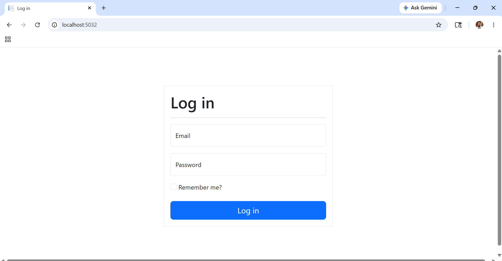
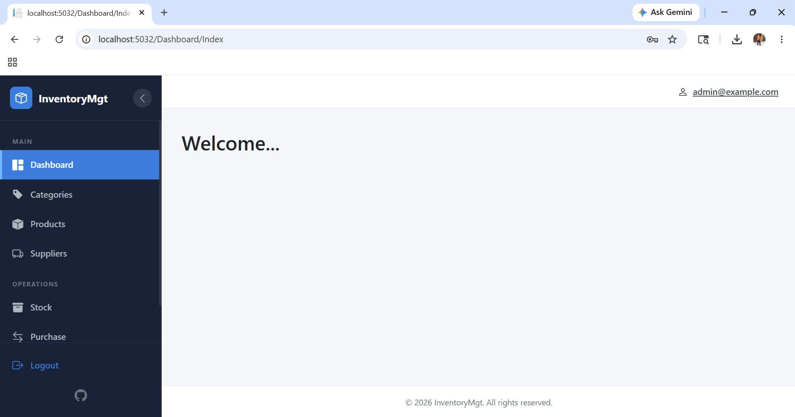
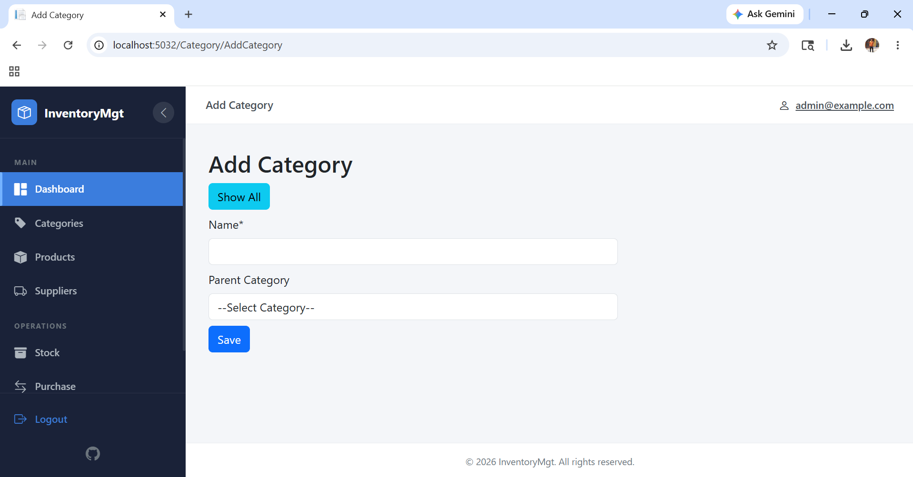
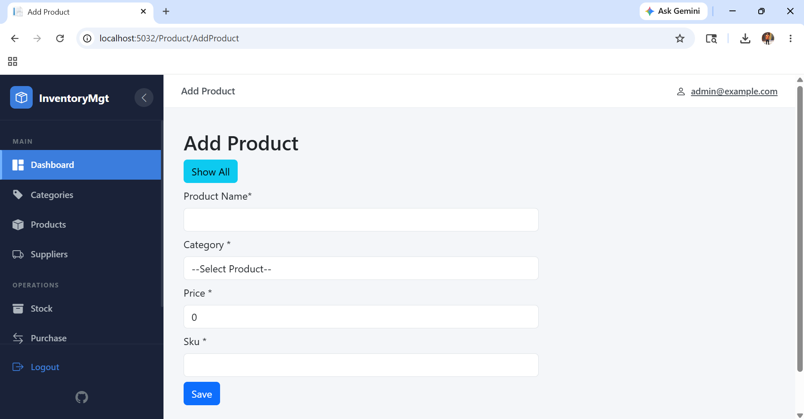
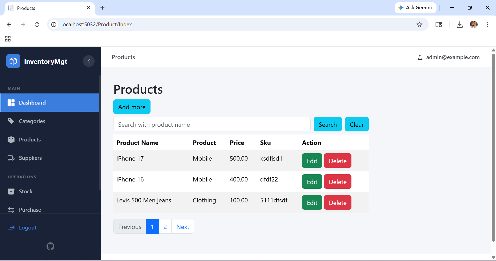
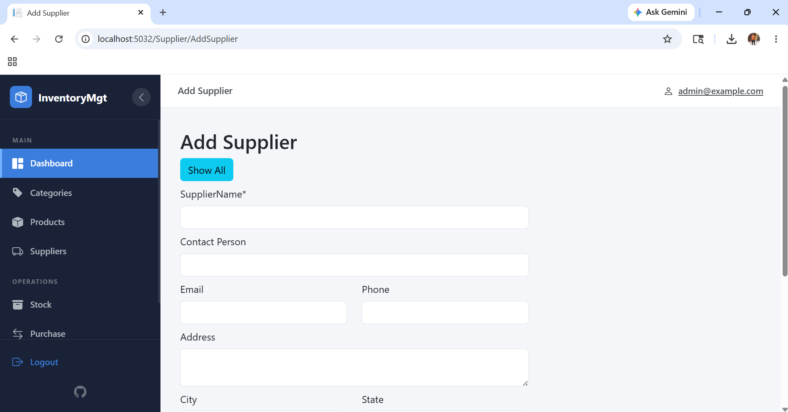
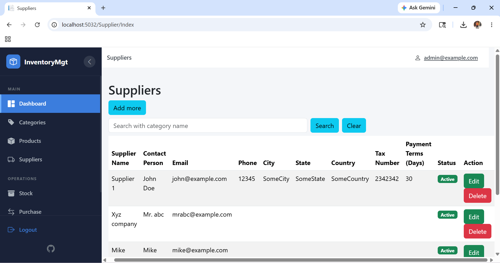
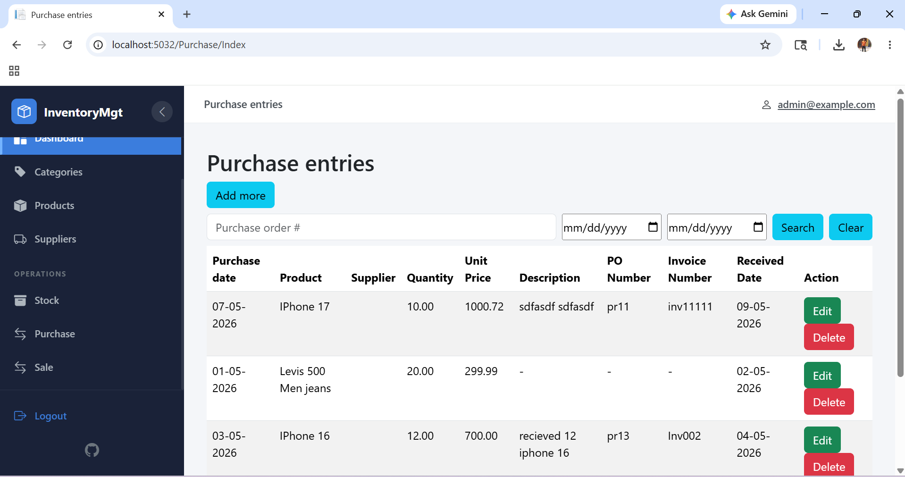
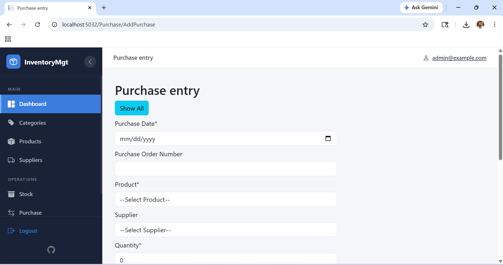

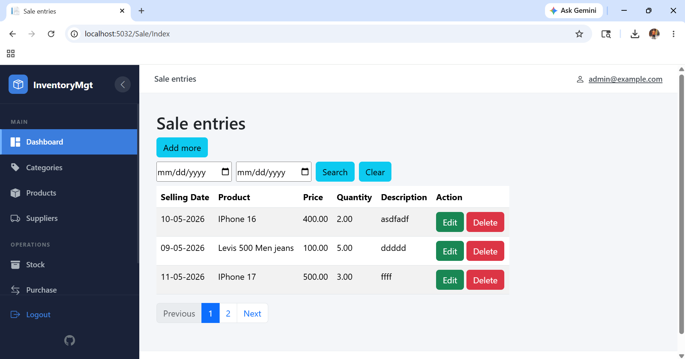
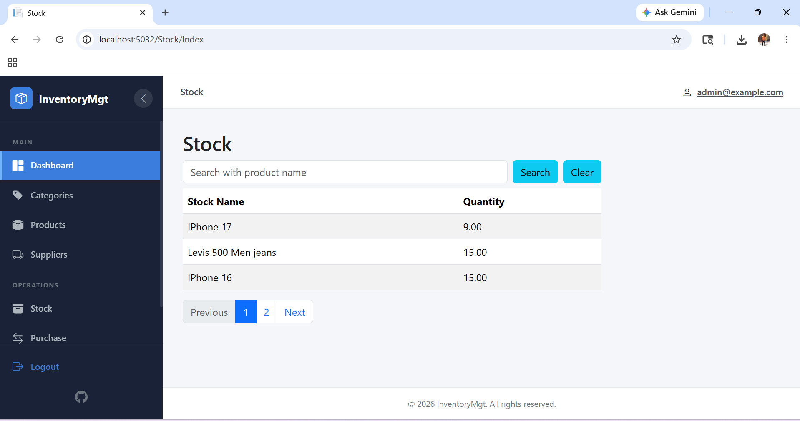
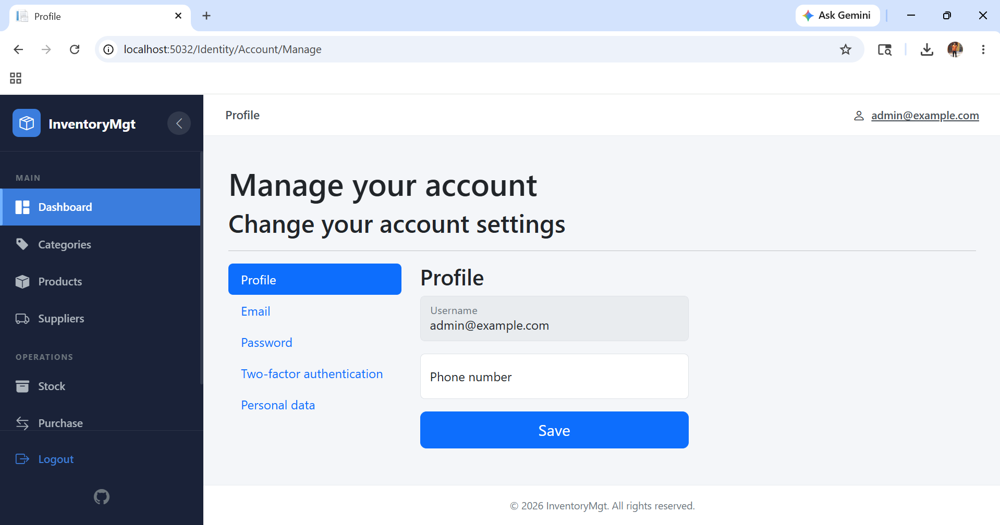

## 📄 License

This project is licensed under the MIT License - see the [LICENSE](LICENSE) file for details.

---

## ⭐ Show Your Support

If you found this project helpful, please consider giving it a star on GitHub! ⭐

**Built with ❤️ by [rd003](https://github.com/rd003)**
